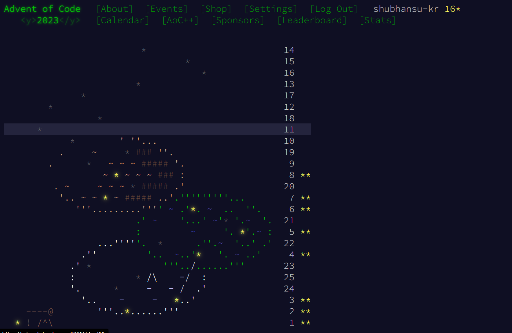

# Advent of Code - 2023

Advent of Code is an annual set of Christmas-themed computer programming challenges that follow an Advent calendar. It has been running since 2015. The programming puzzles cover a variety of skill sets and skill levels and can be solved using any programming language.

I took the advent of code challenge and solved both problems for the first 8 days.

I unfortunately couldn't continue the challenge due to end semester examinations.

This repo tracks the progress of my challenge. I solved the problems using cpp programming language.

## Documentation

This repo contains one file for each day's challenge.
Name of file has a format: `<Day>_<Name>` where days start from `00` followed by a brief name of the puzzle.

Tech Used: Cpp

Each file has 5 parts: 
1. Link: The top comment is the link to the problem
2. Description: Multiline comment containing the description of the problem.
3. Two classes named solution & solution1: 
    - Solution1: Contains solution of the second part
    - Solution: Contains solution of the first part
4. Main part of the code
5. Testcase: The given sample for the puzzle in comments.

I Will try to complete the Advent of Code 2024. See You Next Year. 